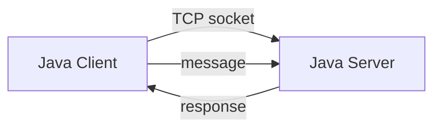
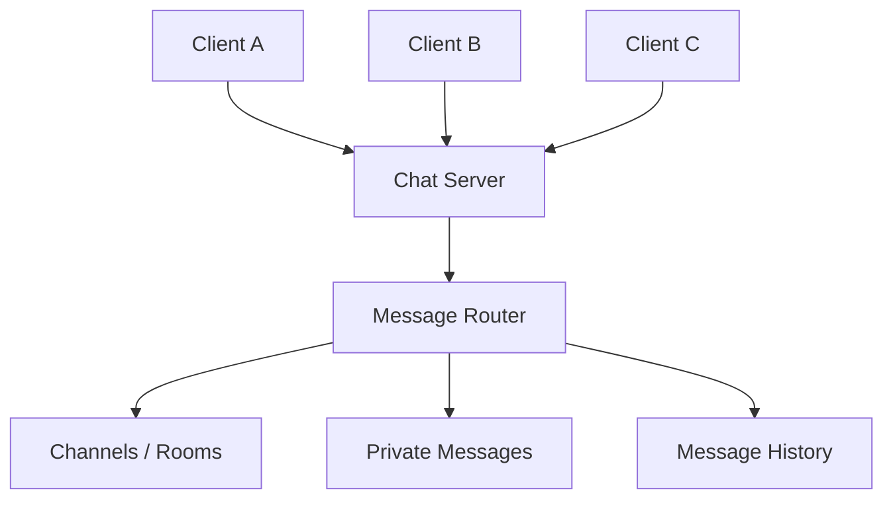

<div align="center">

# 💬 Java Chatroom

**A TCP client-server chat project built in Java to explore sockets, connections and real-time communication.**


</div>

Java Chatroom is a small networking project that connects a Java client to a Java server using TCP sockets.

I built it as a starting point for understanding how applications communicate over a network without relying on a web framework.

## Current architecture



The current version focuses on the fundamentals:

- opening a server socket
- accepting a client connection
- sending messages
- receiving messages
- keeping a conversation running over the connection
- closing the connection cleanly

## Why I built it

Most of my other backend projects use HTTP or frameworks that hide much of the low-level networking.

This project gave me a chance to work directly with sockets and streams so I could understand what happens underneath higher-level communication.

## Current limitation

The current implementation is intentionally small and does not yet behave like a full multi-user chat platform.

At the moment, the project is mainly a client-server networking foundation.

That is the next area I want to expand.

## Where I want to take it

The next version will support multiple users connected to the same server.



## Planned commands

A future version could support commands such as:

```text
/join java
/users
/rooms
/msg username hello
/history
/leave
/quit
```

## Planned features

- multiple simultaneous users
- usernames
- public chat
- private messages
- chat rooms
- join and leave notifications
- timestamps
- message history
- graceful disconnect handling
- thread pool for client connections
- JSON message protocol
- persistent chat history
- automated tests
- Docker support

## What I learned

### A connection is a conversation between two processes

Working directly with sockets helped me understand that communication depends on both sides agreeing on when and how data is sent.

### Network programs need failure handling

A client may disconnect unexpectedly.

The server needs to handle that without bringing down the entire application.

### Concurrency becomes important very quickly

Supporting one client is straightforward.

Supporting many clients at the same time requires a different design, which is the next problem I want to solve in this project.

## Tech stack

| Area | Technology |
|---|---|
| **Language** | Java |
| **Networking** | TCP sockets |
| **Communication** | Java input/output streams |
| **Architecture** | Client-server |

## What's next

- [ ] Support multiple simultaneous clients
- [ ] Add usernames
- [ ] Add broadcast messaging
- [ ] Add private messaging
- [ ] Add chat rooms
- [ ] Replace one-thread-per-client handling with a thread pool
- [ ] Add structured JSON messages
- [ ] Add message history
- [ ] Add tests
- [ ] Add GitHub Actions CI
- [ ] Record a multi-client terminal demo

---

<p align="center">Built by <a href="https://github.com/ZinhleHlongwane">Zinhle Hlongwane</a> · Johannesburg 🇿🇦 · <a href="https://www.linkedin.com/in/zinhle-hlongwane-872354209">LinkedIn</a></p>
